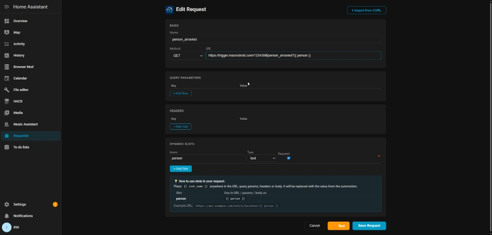
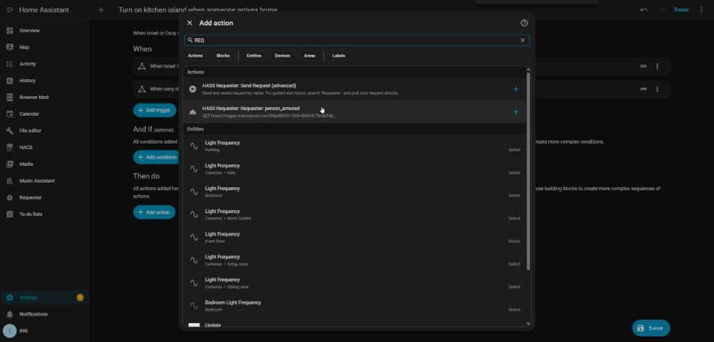
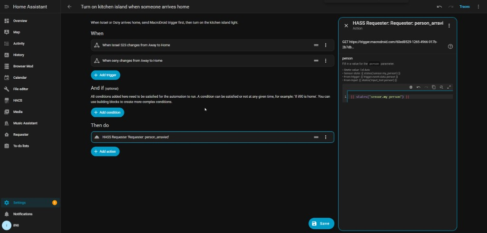

# HASS Requester

[](https://github.com/hacs/integration)


[](https://my.home-assistant.io/redirect/hacs_repository/?owner=il90il90&repository=hass-requester&category=integration)

[](https://my.home-assistant.io/redirect/config_flow_start/?domain=hass_requester)

Send HTTP requests from Home Assistant automations with a beautiful panel UI and dynamic slot parameters.

---

## Features

- **Panel UI** — Manage all your HTTP requests from the HA sidebar
- **CURL Import** — Paste any curl command and it auto-fills the form
- **Dynamic Slots** — Define parameters that are filled at automation call time
- **All HTTP Methods** — GET, POST, PUT, PATCH, DELETE
- **Full Headers & Body** — JSON, Form, Text body types supported
- **Jinja2 Templates** — Use HA state values and trigger data anywhere in the request
- **Automation UI** — Each request appears as a dedicated service with labeled slot fields

---

## Screenshots

### Panel — Request Editor
Define your request once with dynamic slots. The hint box shows exactly how to reference each slot in your URL.



### Automation — Action Picker
Search for `Requester:` to find your request directly. Each saved request appears as a dedicated action.



### Automation — Guided Slot Inputs
Select your request and get labeled fields with examples for each slot — static values or HA templates.



---

## Installation via HACS

### Step 1 — Add as Custom Repository

1. Open **HACS** in your Home Assistant sidebar
2. Click the **⋮ menu** (top right) → **Custom repositories**
3. Enter the repository URL:
   ```
   https://github.com/il90il90/hass-requester
   ```
4. Set **Category** to `Integration`
5. Click **Add**

### Step 2 — Install

1. Search for **HASS Requester** in HACS
2. Click **Download**
3. **Restart Home Assistant**

### Step 3 — Add the Integration

1. Go to **Settings → Integrations → Add Integration**
2. Search for **HASS Requester**
3. Click to add — no configuration needed
4. The **Requester** panel appears in your sidebar

---

## Usage

### 1. Create a Request

Open the **Requester** panel → **New Request**

- Paste a curl command via **Import from CURL** to auto-fill all fields
- Or fill in the URL, method, headers, and body manually
- Add **Dynamic Slots** for any value that changes per automation call
- The hint box shows exactly how to reference each slot in your URL (e.g. `{{ location }}`)
- Click **Test** to send the request live before saving
- Click **Save Request**

### 2. Call from Automation — Two Ways

#### Option A: Guided UI (recommended)

In the automation editor, search for **`Requester:`** and pick your request directly.
Each slot appears as a labeled field with examples:

```yaml
action:
  - action: hass_requester.testisrael
    data:
      location: "{{ trigger.event.data.location }}"
```

#### Option B: Generic service with YAML params

```yaml
action:
  - action: hass_requester.send
    data:
      request: my_request       # name of the saved request
      params:
        location: "Tel Aviv"    # static value
        city: "{{ states('input_text.city') }}"  # dynamic HA template
```

---

## Example: Dynamic location with one request

**Before** — two separate `rest_command` entries:

```yaml
rest_command:
  person_arrived_home:
    url: "https://api.example.com/notify?location=home"
  person_arrived_work:
    url: "https://api.example.com/notify?location=work"
```

**After** — one request with a `location` slot:

```yaml
# URL defined once in the panel:
# https://api.example.com/notify?location={{ location }}

action:
  - action: hass_requester.send
    data:
      request: person_arrived
      params:
        location: "{{ trigger.event.data.location }}"
```

---

## Service Reference

### `hass_requester.send` (advanced / generic)

| Field | Type | Required | Description |
|---|---|---|---|
| `request` | string | yes | Name of the saved request |
| `params` | object | no | Key-value pairs for dynamic slots. Supports HA templates. |

### `hass_requester.<request_name>` (per-request, guided)

Each saved request automatically registers its own service with a labeled field per slot.
Search for `Requester:` in the automation editor action picker.

---

## Slot Types

| Type | Description | Example value |
|---|---|---|
| `text` | Any string | `"hello"` or `"{{ states('sensor.name') }}"` |
| `select` | Fixed set of options | `"option_a"` |
| `number` | Numeric value | `42` |
| `boolean` | true / false | `true` |

---

## Development

```bash
# Install frontend dependencies
cd frontend
npm install

# Build (output goes to custom_components/hass_requester/www/)
npm run build
```

---

## License

MIT
